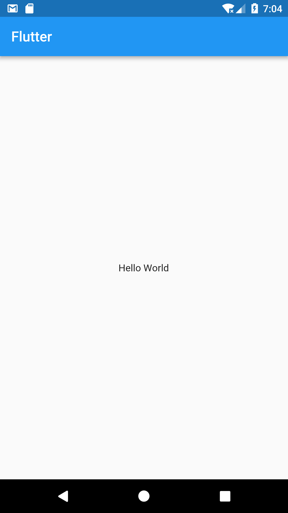
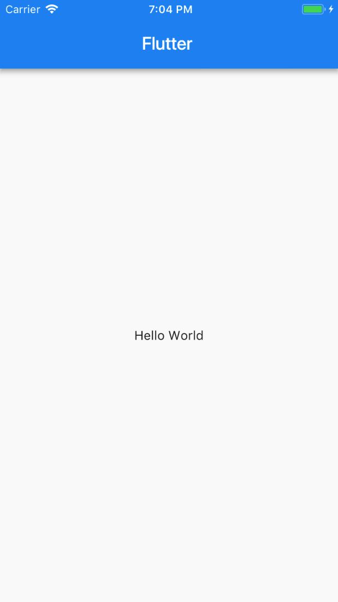
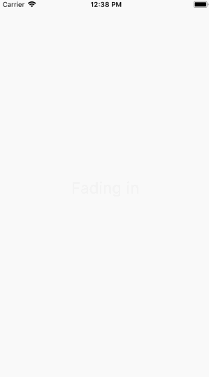

# Flutter for React Native Developers
This document is meant for React Native developers looking to apply their existing React Native knowledge to build mobile apps with Flutter. If you understand the fundamentals of the React Native framework, then you can use this document as a jump start to Flutter development. 

While React Native uses Javascript, Flutter uses a language called Dart.  
## A Brief Introduction to Dart for JavaScript Developers
Dart is an open-source, scalable programming language, for building web, server, and mobile apps. It is an object-oriented, class defined, single inheritance language that uses a C-style syntax that transcompiles optionally into JavaScript. It supports interfaces, abstract classes, optional typing, and a sound type system.
### Entry Point
While JavaScript doesn't have any specific entry function, Dart does have an entry function called `main()`.
```javascript
// JavaScript
function main() {
  // Can be used as entry point
}
// but it has to be called manually.
main();
```
```dart
// Dart
main() {
}
```
### Printing to the console
Printing data to the console can be done in the following way.
```javascript
// JavaScript
console.log("Level completed.");
```
```dart
// Dart
print('Hello World');
```
### Variables
#### Creating and Assigning Variables
While JavaScript variables cannot be typed, Dart variables can be typed (but don't need to be).
```javascript
// JavaScript
var name = "JavaScript";
```
```dart
// Dart
String name = 'dart';
var otherName = 'Dart';
// Both are acceptable in Dart.
```
#### Default value
In Dart, uninitialized variables have an initial value of `null`. Even variables with numeric types are initially null because numbers are objects in Dart. But in JavaScript, variables are `undefined`.
```javascript
// JavaScript
var name; // == undefined
```
```dart
// Dart
var name; // == null
int x; // == null
```
### Checking for null/zero
In Dart, only the boolean value true is treated as true. But in JavaScript, values like 1 or any other non-null objects are treated as true.
```javascript
// JavaScript
var myNull = null;
if (!myNull) {
  console.log("null is treated as false");
}
var zero = 0;
if (!zero) {
  console.log("0 is treated as false");
}
```
```dart
// Dart
var myNull = null;
if (myNull == null) {
  print('use == null to check null');
}
var zero = 0;
if (zero == 0) {
  print('use == 0 to check zero');
}
```
### Functions
For the most part, Dart and JavaScript functions are similar. The only thing that's different in Dart and JavaScript functions is the declaration.
```javascript
//JavaScript
function fn() {
  return true;
}
```
```dart
//Dart
fn() {
  return true;
}
// can also be written as
bool fn() {
  return true;
}
```
### Asynchronous Programming
#### Future
Like JavaScript, Dart supports single-threaded execution. In JavaScript, the `Promise` object represents the eventual completion (or failure) of an asynchronous operation and its resulting value.
```javascript
// JavaScript
_getIPAddress = () => {
  return fetch("https://httpbin.org/ip")
    .then(response => response.json())
    .then(responseJson => {
      this.setState({ _ipAddress: responseJson.origin });
    })
    .catch(error => {
      console.error(error);
    });
};
```
Whereas Dart uses [`Future`](https://www.dartlang.org/tutorials/language/futures) objects to handle this.
```dart
// Dart
_getIPAddress() {
  String url = 'https://httpbin.org/ip';
  var httpClient = createHttpClient();
  Future response = httpClient.get(url);
  response.then((value) {
    setState(() {
      _ipAddress = JSON.decode(value.body)['origin'];
    });
  }).catchError((error) => print(error));
}
```
#### async / await
The async function declaration defines an asynchronous function. In JavaScript, when an async function is called, it returns a `Promise`. The `await` operator is used to wait for a `Promise`.
```javascript
// JavaScript
async _getIPAddress() {
  const response = await fetch("https://httpbin.org/ip");
  const json = await response.json();
  const data = await json.origin;
  this.setState({ _ipAddress: data });
}
```
Whereas in Dart,an `async` function returns a `Future`, and the body of the function is scheduled for execution later. The `await` operator is used to wait for a `Future`.
```dart
// Dart
_getIPAddress() async {
  String url = 'https://httpbin.org/ip';
  var httpClient = createHttpClient();
  var response = await httpClient.read(url);
  String ip = JSON.decode(response)['origin'];
  setState(() {
    _ipAddress = ip;
  });
}
```
#### Streams
A stream is a sequence of ongoing events that are ordered in time. It can emit three different things:
* a value (of some type)
* an error
* a "completed" signal.
  Streams are cheap and ubiquitous. Anything can be a stream; Variables, user inputs, properties, caches, data structures, etc.
Generator functions afford us the power of streams in JavaScript.Consider this example in Javascript,
```javascript
var sum=0;
function* sumStream () {
  let n = 1;
  while (true) {
    yield sum=sum+n++;
  }
}
const nats = Numbers();
function countStream (to){
  var i;
  var sum2;
  for(i=1;i<=to;i++){
    sum2=nats.next().value;
  }
return sum2;
}
var sum1=countStream (10);
console.log(sum1); // 55
```
In the above example, We keep track of the current number in the sequence with n. We set n = 1 because naturally (pun intended) the natural numbers start with 1. Then, inside an infinite loop, we yield n and increment it to the next number in the sequence.
In Dart, Streams can be created in many ways, but they can all be used in the same way: the asynchronous for loop (commonly just called await for) iterates over the events of a stream like the for loop iterates over an Iterable. For example:
```dart
// Dart
Future<int> sumStream(Stream<int> stream) async {
  var sum = 0;
  await for (var value in stream) {
    sum += value;
  }
  return sum;
}
Stream<int> countStream(int to) async* {
  for (int i = 1; i <= to; i++) {
    yield i;
  }
}
main() async {
  var stream = countStream(10);
  var sum = await sumStream(stream);
  print(sum); // 55
}
```
This code simply receives each event of a stream of integer events, adds them up, and returns (a future of) the sum. When the loop body ends, the function is paused until the next event arrives or the stream is done.


**Note:** You can refer [here](https://www.dartlang.org/resources/synonyms) for more differences.

## Learn The Basics
### What is the equivalent of React Native `Hello World` app in Flutter?
In React Native, you would start off your development process by creating the project using the below command line tool.
```sh
$ create-react-native-app {projectname}
```
In [Flutter](https://flutter.io/getting-started/), you can use this command line tool to do the same.
```sh
$ flutter create {projectname}
``` 
### How do I run my app?
In React Native, you would go to the project directory and use 
`npm run ios/android` or `yarn run ios/android`.
In [Flutter](https://flutter.io/getting-started/), if you are using the terminal, then you use the `flutter run` command in the project root directory to run your app on a connected device or simulator. 
If you are using IntelliJ IDE, then you can just press the `run` icon in the toolbar of the project.
### How do I use import statements?
```javascript
//React Native
import React from "react";
import { StyleSheet, Text, View } from "react-native";
```
Contrary to React Native’s way of importing each component as they are used.
In Flutter, you import the `material.dart` from the flutter package, which allows you to use any material design widget without exclusively importing it.
```dart
import 'package:flutter/material.dart';
```
Let’s have a look at each of the classes :
```javascript
// React Native
export default class App extends React.Component {
  render() {
    return (
      <View style={styles.container}>
        <Text>Hello World</Text>
      </View>
    );
  }
}
```
```dart
//Flutter
class App extends StatelessWidget {
@override
  Widget build(BuildContext context) {
    return new Center(
      child: new Text( 'Hello World'),
    );
  }
}
```
The `App` class in React Native extends `React.Component` and implements the render method by returning a view component as shown.
In Flutter, the execution starts off with the `main()` function.
### How do I use Widgets and nest them to form a Widget tree?
When writing an app, you will commonly author new widgets that are subclasses of either [StatelessWidget](https://docs.flutter.io/flutter/widgets/StatelessWidget-class.html) or [StatefulWidget](https://docs.flutter.io/flutter/widgets/StatefulWidget-class.html), depending on whether your widget manages any state. In the above Hello World example, MyApp class extends a StatelessWidget and overrides a build function which describes the widget in terms of other, lower-level widgets.
In the above example, the widget tree consists of three widgets, the [Center](https://docs.flutter.io/flutter/widgets/Center-class.html), [Column](https://docs.flutter.io/flutter/widgets/Column-class.html) and the [Text](https://docs.flutter.io/flutter/widgets/Text-class.html) widget. The framework forces the root widget to cover the screen, which means the text “Hello World” ends up centered on the screen. In simple apps, it is easy to nest widgets but as the code base gets larger and the app becomes complex, it is advisable to break deeply nested widgets into functions that return the widget or smaller classes.

##### Preview
|Android|iOS|
|:---:|:--:|
|||


**Note:** You can check the working code for [Flutter](https://github.com/GeekyAnts/flutter-docs-code-samples/blob/master/hello-world/flutterhelloworld/lib/main.dart) and its equivalent [React Native](https://github.com/GeekyAnts/flutter-docs-code-samples/tree/master/hello-world/rnhelloworld) code.

### How do I create reusable components and use them?
In React Native, you would create a separate class for reusable component and use that class as a component. You would then use props to access the passed variables and functions. In the example, we create a custom card class and used it inside parent class.
```javascript
// React Native
class CustomCard extends React.Component {
  render() {
    return (
      <View>
        <Text > Card {this.props.index} </Text>
        <Button
          title="Press"
          onPress={() => this.props.onPress(this.props.index)}
        />
      </View>
    );
  }
}
//usage
<CustomCard onPress={this.onPress} index={item.key} />
```
Similarly, in Flutter, you just create a class for custom widgets and use it as you would use a normal widget.
Alternatively, you can also create and call a function that returns the widget.
```dart
// Flutter
class CustomCard extends StatelessWidget {
  CustomCard({this.index, this.onPress});
  final int index;
  final Function onPress;
  @override
  Widget build(BuildContext context) {
  return new Card(
    child: new Column(
      children: <Widget>[
        new Text(
          'Card $index',
        ),
        new FlatButton(
          child: const Text('Press'),
            onPressed: this.onPress,
          ),
      ],
    ));
  }
}
    ...
//Usage
new CustomCard(
  index: index,
  onPress: () {
    print('Card $index');
  },
)
    ...
```

##### Preview
|Android|iOS|
|:---:|:--:|
|||


**Note:** You can check the working code in [Flutter](https://github.com/GeekyAnts/flutter-docs-code-samples/blob/master/modular/fluttermodular/lib/main.dart) and its equivalent [React Native](https://github.com/GeekyAnts/flutter-docs-code-samples/blob/master/modular/rnmodular/App.js) code.
## Project Structure & Resources
### Where do I start writing the code?
If you have used CRNA (create-react-native-app), then you have written your code inside `App.js`. 
In Flutter, the entry file is `’projectname’/lib/main.dart` and execution starts from the main function. The minimal Flutter app simply calls the `runApp` function with a widget. The `runApp` function takes the given Widget and makes it the root of the widget tree. Any widget can be passed to it. But, if you are creating an app that uses material design, you can use [MaterialApp](https://docs.flutter.io/flutter/material/MaterialApp-class.html) class as root and define a theme that can be accessed across the app. If you are creating a screen, then you can use [`Scaffold`](https://docs.flutter.io/flutter/material/Scaffold-class.html). But it is not mandatory.
### How are files structured in a Flutter app?
<pre>
┬
└ projectname
  ┬
  ├ android
  ├ build
  ├ ios
  ├ lib
    ┬
    └ main.dart
  ├ test
  └ pubspec.yaml
</pre>
<b>`root/.idea`</b> - IDE’s project specific settings files.

<b>`root/android`</b> - file containing android native code.

<b>`root/build`</b> - stores iOS apk and Android app installation packages.

<b> `root/ios` </b> - file containing iOS native code.

<b> `root/lib` </b> - Dart source files. This is where you can start writing your Dart code.

<b>`root/test`</b> - automated test files.

<b>`root/pubspec.yaml`</b> - metadata for the app. Equivalent of `package.json` in React Native.

### Where do I put my resources(assets) and how do I use them?
In React Native, to add a static image to your app, place it somewhere in your source code tree and reference it like this :
```javascript
<Image source={require("./my-icon.png")} />
```
Flutter apps can include both code and assets (a.k.a. resources). An asset is a file that is bundled and deployed with your app, and is accessible at runtime. Common types of assets include static data (such as JSON files), configuration files, icons, and images (JPEG, GIF, PNG, and BMP).
All the assets can live under any folder under the root directory, for best practice you can put them under `assets` folder.
Flutter uses the pubspec.yaml file, located at the root of your project, to identify assets required by an app.
```yaml
flutter:
  assets:
    - assets/my_icon.png
    - assets/background.png
```
When an asset’s path is specified in the assets section of pubspec.yaml, the build process looks for any files with the same name in adjacent subdirectories. Such files are then included in the asset bundle along with the specified asset.

It is used like this in the app code,
```
image: new AssetImage(assets/background.png'),
```

### How do I load Images dynamically?

In React Native, you specify the `uri` in the `source` prop of the `Image` component and also provide the size if needed.

```javascript
//React Native
<Image source={{uri: "{URL}" }} style={{width: 400, height: 400}} />
```
In Flutter, using `NetworkImage` creates an object that fetches the image from the given URL.

```dart
// Flutter
new NetworkImage("{URL}"),
```

### What are the standard practices to structure your mobile app?
To better structure your app, all the source files go into `/lib`.
<pre>
┬
└ projectname
  ┬
  └ lib
    ┬
    ├ components
    ├ screens
    ├ utils
    ├ themes
    ├ routes.dart
    └ main.dart
</pre>

<b>`lib/components`</b> - contains all the small components.

<b>`lib/screens`</b> - contains screens using components.

<b>`lib/utils`</b> - contains reusable functions.

<b>`lib/themes`</b> - contains themes which can be used globally.

<b>`lib/routes.dart`</b> - contains all the routes.

<b>`lib/main.dart`</b> - entry point the app.

### How do I install plugins/packages?
In Flutter, you cannot install packages from the command-line like in React Native where you use :
`yarn add {package-name}` / `npm install --save {package-name}`.


To install package in flutter follow these steps:

* Add package name and version to your package's `pubspec.yaml` dependencies.
* Install package from command line by running `flutter packages get`.
* Import the package in your code.

You can find the Flutter packages [here](https://pub.dartlang.org/flutter/packages) and compare them based on their scores.

## Built-In Widgets
Flutter widgets are built using a modern react-style framework, which takes inspiration from React. The central idea is that you build your UI out of widgets. Widgets describe what their view should look like given their current configuration and state.

### Views
### What is the equivalent of a `View` in Flutter?
In React Native, View is a container that supports layout with <b>`Flexbox`</b>, style, touch handling, and accessibility controls. In Flutter, we have layout specific widgets like [Container](https://docs.flutter.io/flutter/widgets/Container-class.html), [Column](https://docs.flutter.io/flutter/widgets/Column-class.html), [Row](https://docs.flutter.io/flutter/widgets/Row-class.html), [Center](https://docs.flutter.io/flutter/widgets/Center-class.html) etc. You can also use [Scaffold](https://docs.flutter.io/flutter/material/Scaffold-class.html) which provides options for showing drawers, snack bars, and bottom sheets.

**Note:** You can also check the layout widget catalog [here](https://flutter.io/widgets/layout/).

### What is the equivalent of `FlatList` / `ListView`?
List is a scrollable list of components arranged linearly. In React Native we use `FlatList` or `ListView` for a performant interface for rendering simple, flat lists.
```javascript
// React Native
<FlatList
  data={[ ... ]}
  renderItem={({ item }) => <Text>{item.key}</Text>}
/>
```
In Flutter, [`ListView`](https://docs.flutter.io/flutter/widgets/ListView-class.html) is Flutter's most commonly used scrolling widget. The default constructor takes an explicit list of children. It is appropriate to use [`ListView`](https://docs.flutter.io/flutter/widgets/ListView-class.html) for a small number of widgets. The `ListView.builder` takes an `IndexedWidgetBuilder`, which builds the children on demand. This constructor is appropriate for list views with a large (or infinite) number of children because the builder is called only for those children that are actually visible.
```dart
// Flutter
var data = [ ... ];
new ListView.builder(
  itemCount: data.length,
  itemBuilder: (context, int index) {
    return new Text(
      data[index],
    );
  },
)
```

##### Preview
|Android|iOS|
|:---:|:--:|
|||


**Note:** You can check the working code for [Flutter](https://github.com/GeekyAnts/flutter-docs-code-samples/blob/master/scrollable/flutterscrollable/lib/main.dart) and its equivalent [React Native](https://github.com/GeekyAnts/flutter-docs-code-samples/blob/master/scrollable/rnscrollable/App.js) code.
### How do I use a Canvas to draw/paint?
In React Native, no in-built canvas component is present, so we use third party libraries like `react-native-canvas` to use canvas.
```javascript
// React Native
handleCanvas = canvas => {
  const ctx = canvas.getContext("2d");
  ctx.fillStyle = "skyblue";
  ctx.beginPath();
  ctx.arc(75, 75, 50, 0, 2 * Math.PI);
  ctx.fillRect(150, 100, 300, 300);
  ctx.stroke();
};
render() {
  return (
    <View>
      <Canvas ref={this.handleCanvas} />
    </View>
  );
}
```
In Flutter, we use [`CustomPaint`](https://docs.flutter.io/flutter/widgets/CustomPaint-class.html) widget to draw during the paint phase. We implement abstract class [`CustomPainter`](https://docs.flutter.io/flutter/rendering/CustomPainter-class.html) and pass it to `painter` property in `CustomPaint` widget.
```dart
// Flutter
class MyCanvasPainter extends CustomPainter {
  @override
  void paint(Canvas canvas, Size size) {
    Paint paint = new Paint();
    paint.color = Colors.amber;
    canvas.drawCircle(new Offset(100.0, 200.0), 40.0, paint);
    Paint paintRect = new Paint();
    paintRect.color = Colors.lightBlue;
    Rect rect = new Rect.fromPoints(new Offset(150.0, 300.0), new Offset(300.0, 400.0));
    canvas.drawRect(rect, paintRect);
  }
  bool shouldRepaint(Sky oldDelegate) => false;
  bool shouldRebuildSemantics(Sky oldDelegate) => false;
}
class _MyCanvasState extends State<MyCanvas> {
  @override
  Widget build(BuildContext context) {
    return new Scaffold(
      body: new CustomPaint(
        painter: new MyCanvasPainter(),
      ),
    );
  }
}
```
##### Preview
|Android|iOS|
|:---:|:--:|
|||


**Note:** You can check the working code for [Flutter](https://github.com/GeekyAnts/flutter-docs-code-samples/blob/master/scrollable/flutterscrollable/lib/main.dart) and its equivalent [React Native](https://github.com/GeekyAnts/flutter-docs-code-samples/blob/master/scrollable/rnscrollable/App.js) code.

### Layouts
### How do I layout my Widgets?
In React Native, you would normally use the style prop on the view component to specify the flexbox properties to layout the underlying components like this :
```javascript
// React Native
<View
  style={{
    flex: 1,
    flexDirection: "column",
    justifyContent: “space-between”,
    alignItems: “center”
  }}
>
```
In Flutter, layout is determined by a combination of the type of Widget that you choose and its layout and style properties.
For example, the [Column](https://docs.flutter.io/flutter/widgets/Column-class.html) or [Row](https://docs.flutter.io/flutter/widgets/Row-class.html) takes an array of children and not styling properties (only layout properties such as `CrossAxisAlignment` and `direction` among others), while [Container](https://docs.flutter.io/flutter/widgets/Container-class.html) takes a combination of layout and styling properties. You can use a [`Center`](https://docs.flutter.io/flutter/widgets/Center-class.html) widget to center the child widget tree.
```dart
// Flutter
new Center(
  child: new Container(
    child: new Column(
      mainAxisAlignment: mainaxis,
      children: <Widget>[
        new Container(
          color: Colors.red,
          width: 100.0,
          height: 100.0,
        ),
        new Container(
          color: Colors.blue,
          width: 100.0,
          height: 100.0,
        ),
        new Container(
          color: Colors.green,
          width: 100.0,
          height: 100.0,
        ),
      ],
    ),
  ),
);
```
Another example would be when you need to align your components in a [Row](https://docs.flutter.io/flutter/widgets/Row-class.html) or [Column](https://docs.flutter.io/flutter/widgets/Column-class.html). 

In React Native, you would specify it as a prop. `flexDirection: “row”` . But in Flutter, you would use a [`Row`](https://docs.flutter.io/flutter/widgets/Row-class.html) widget and provide the required widget/widget tree as its children.

##### Preview
|Android|iOS|
|:---:|:--:|
|||


**Note:** You can check the working code for [Flutter](https://github.com/GeekyAnts/flutter-docs-code-samples/tree/master/Layout_sample/flutter-basic-layout-code/basiclayout_sample) and its equivalent [React Native](https://github.com/GeekyAnts/flutter-docs-code-samples/tree/master/Layout_sample/rn-simple-layout) code.

### How do I overlap several widgets on top of one another?
In React Native, we can overlap several components by using `absolute` positioning. In Flutter, we use [`Stack`](https://docs.flutter.io/flutter/widgets/Stack-class.html) to arrange widgets on top of a base widget. The widgets can completely or partially overlap the base widget.

`Stack` positions its children relative to the edges of its box. This class is useful if you want to overlap several children in a simple way.
```dart
// Flutter
new Stack(
  alignment: const Alignment(0.6, 0.6),
  children: [
    new CircleAvatar(
      backgroundImage: new NetworkImage(
        "https://avatars3.githubusercontent.com/u/14101776?v=4"),
      ),
      new Container(
        decoration: new BoxDecoration(
          color: Colors.black45,
      ),
      child: new Text(
        'Flutter’,
      ),
  ],
);
```
The above example uses `Stack` to overlay a Container (that displays its `Text` on a translucent black background) on top of a `CircleAvatar`. The Stack offsets the text using the alignment property and Alignments.

### Styling
### How to custom style my components in Flutter?
In React Native, we can use inline styling as well as `stylesheets.create`.
```javascript
// React Native
<View style={styles.container}>
  <Text style={{ fontSize: 32, color: "cyan", fontWeight: "600" }}>
    This is a sample text
  </Text>
</View>
```
```javascript
const styles = StyleSheet.create({
  container: {
    flex: 1,
    backgroundColor: "#fff",
    alignItems: "center",
    justifyContent: "center"
  }
});
```
Similarly in Flutter, widgets are highly customizable and layout specific components like [`Padding`](https://docs.flutter.io/flutter/widgets/Padding-class.html), [`Center`](https://docs.flutter.io/flutter/widgets/Center-class.html),[`Card`](https://docs.flutter.io/flutter/material/Card-class.html), [`Stack`](https://docs.flutter.io/flutter/widgets/Stack-class.html) etc. can be used. If you want to use same text style at multiple places, you can use [`TextStyle`](https://docs.flutter.io/flutter/dart-ui/TextStyle-class.html) class and provide it to style property of Text.
```dart
// Flutter
var textStyle = new TextStyle(fontSize: 32.0, color: Colors.cyan, fontWeight: FontWeight.w600);
	...
new Center(
  child: new Column(
    mainAxisAlignment: MainAxisAlignment.center,
    children: <Widget>[
      new Text(
        'Sample text',
        style: textStyle,
      ),
      new Padding(
        padding: new EdgeInsets.all(20.0),
        child: new Icon(Icons.lightbulb_outline,
          size: 48.0, color: Colors.redAccent)
      ),
    ],
  ),
)
```

##### Preview
|Android|iOS|
|:---:|:--:|
|||


**Note:** You can check the working code for [Flutter](https://github.com/GeekyAnts/flutter-docs-code-samples/blob/master/styling/flutterstyling/lib/main.dart) and its equivalent [React Native](https://github.com/GeekyAnts/flutter-docs-code-samples/blob/master/styling/rnstyling/App.js) code.

### How to use `Icons` and `Colors` in Flutter?
There is no in-built support for icons in React Native, so third party libraries have to be used. Flutter has in-built support for material icons and to use them [`Icons`](https://docs.flutter.io/flutter/material/Icons-class.html) class is used. 

You can get the list of all icons [here](https://docs.flutter.io/flutter/material/Icons-class.html#constants).

For Colors, [`Colors`](https://docs.flutter.io/flutter/material/Colors-class.html) class is used which uses Material design's [color palette](https://material.io/guidelines/style/color.html).
```dart
new Icon(Icons.lightbulb_outline, color: Colors.redAccent)
```
### How to add style themes in Flutter?
In React Native, we define common themes for components in stylesheets and use it in components.
Similarly, we an add uniform styling for almost everything by defining it in [`themeData`](https://docs.flutter.io/flutter/material/ThemeData-class.html) class and passing it to theme property in [`MaterialApp`](https://docs.flutter.io/flutter/material/MaterialApp-class.html) that wraps all the widgets and acts as the root widget of the app.
```dart
class MyApp extends StatelessWidget {
  @override
  Widget build(BuildContext context) {
    return new MaterialApp(
      theme: new ThemeData(
        primaryColor: Colors.cyan,
        brightness: Brightness.dark,
      ),
      home: new MyHomePage(),
    );
  }
}
```
## State Management
### What are Stateful and Stateless widgets and how do I use them?
In React Native, we do not have state-specific components, you can call `setState` in any component provided it manages that state. In Flutter, we have Stateful and Stateless widgets where you can use `setState` only in [StatefulWidget](https://docs.flutter.io/flutter/widgets/StatefulWidget-class.html).
```javascript
// React Native
class App extends Component {
  constructor(props) {
    super(props);
    this.state = { blink: true };
  }
  toggleBlinkState() {
    this.setState({blink: !this.state.blink});
  }
      ...
}
```
A widget which has no internal state to manage is a Stateless widget. [Icons](https://docs.flutter.io/flutter/material/Icons-class.html), [IconButton](https://docs.flutter.io/flutter/material/IconButton-class.html), and [Text](https://docs.flutter.io/flutter/widgets/Text-class.html) are examples of stateless widgets, which subclass [StatelessWidget](https://docs.flutter.io/flutter/widgets/StatelessWidget-class.html).
Stateless widgets are useful when the part of the user interface you are describing does not depend on anything other than the configuration information in the object itself and the [`BuildContext`](https://docs.flutter.io/flutter/widgets/BuildContext-class.html) in which the widget is inflated.
```dart
// Flutter
class MyApp extends StatelessWidget {
  @override
  Widget build(BuildContext context) {
    return new MaterialApp(
      home: new MyHomePage(),
    );
  }
}
```
The build method of a stateless widget is typically only called in three situations:
* When the widget is inserted in the tree
* When the widget's parent changes its configuration
* When an [`InheritedWidget`](https://docs.flutter.io/flutter/widgets/InheritedWidget-class.html) it depends on changes.

A `MyHomePage` stateful widget can be given as the child to a Stateless widget as shown above.

A stateful widget is dynamic. The user can interact with a stateful widget (by typing into a form, or moving a slider, for example), or it changes over time (perhaps a data feed causes the UI to update). [Checkbox](https://docs.flutter.io/flutter/material/Checkbox-class.html), [Radio](https://docs.flutter.io/flutter/material/Radio-class.html), [Slider](https://docs.flutter.io/flutter/material/Slider-class.html), [InkWell](https://docs.flutter.io/flutter/material/InkWell-class.html), [Form](https://docs.flutter.io/flutter/widgets/Form-class.html), and [TextField](https://docs.flutter.io/flutter/material/TextField-class.html) are examples of stateful widgets, which subclass [StatefulWidget](https://docs.flutter.io/flutter/widgets/StatefulWidget-class.html).
State is information that can be read synchronously when the widget is built and might change during the lifetime of the widget. It is the responsibility of the widget implementer to ensure that the State is promptly notified when such state changes, `Stateful` widget is useful when the part of the user interface you are describing can change dynamically.

The code snippet below shows how to define a stateful widget and use `createState` to create a state of the MyHomePage widget.
```dart
class MyHomePage extends StatefulWidget {
  MyHomePage({Key key, this.title}) : super(key: key);
  final String title;
  @override
  _MyHomePageState createState() => new _MyHomePageState();
}
```
The below code snippet shows how the state implements the build function and also how `setState` function is used to rebuild (recall the build function of the stateful `_MyHomePageState` widget).
```dart
class _MyHomePageState extends State<MyHomePage> {
  bool showtext=true;
  bool toggleState=true;
  Timer t2;
  void toggleBlinkState(){
    setState((){ toggleState=!toggleState;});
    if(toggleState==false) {
      toggleShowText();
    } else {
      t2.cancel();
    }
  }
  void toggleShowText(){
    setState((){
      showtext=!showtext;
    });
	}
  @override
  Widget build(BuildContext context) {
    return new Scaffold(
      body: new Center(
        child: new Column(
          children: <Widget>[
            (showtext?( new Text('This execution will be done before you can blink.'))
              :
            (new Container())),
            new Padding(
              padding: new EdgeInsets.only(top: 70.0),
              child: new RaisedButton(
                onPressed: toggleBlinkState,
                child: (toggleState?( new Text("Blink")) : (new Text("Stop Blinking")))
              )
            )
          ],
        ),
      ),
    );
  }
}
```
### What are some of the best practices while using Stateful and Stateless widgets?
#### • Figure out which widget must be Stateful and Stateless?
Some widgets are Stateful, and some are Stateless.
If a widget changes—the user interacts with it, it’s Stateful otherwise it can be Stateless.
Stateful widgets are useful when the part of the user interface you are describing can change dynamically.
#### • If using Stateful widget, decide which object manages the widget’s state
There are three main ways to manage state:
* The widget manages its own state.
* The parent manages the widget’s state.
* A mix-and-match approach
  
#### • How do you decide which approach to use? The following principles should help you decide:
* If the state in question is user data: The checked or unchecked mode of a checkbox, or the position of a slider, then the state is best managed by the parent widget.
* If the state in question is aesthetic: then the state is best managed by the widget itself.
* When in doubt, let the parent widget manage the child widget's state.
* Subclass StatefulWidget and State
  The `MyHomePage` class manages its own state, so it overrides `createState()` to create the State object. The framework calls `createState()` when it wants to build the widget. In this example, `createState()` creates an instance of `_MyHomePageState` , which is implemented in the next step.
```dart
class MyHomePage extends StatefulWidget {
  MyHomePage({Key key, this.title}) : super(key: key);
  final String title;
	@override
  _MyHomePageState createState() => new _MyHomePageState();
}
class _MyHomePageState extends State<MyHomePage> {
  @override
  Widget build(BuildContext context) {
    ...
  }
}
```
#### • Plug the stateful widget into the widget tree
Add your custom stateful widget to the widget tree in the app’s build method.
```dart
class MyApp extends StatelessWidget {
  // This widget is the root of your application.
  @override
  Widget build(BuildContext context) {
    return new MaterialApp(
      title: 'Flutter Demo',
      theme: new ThemeData(
        primarySwatch: Colors.blue,
      ),
      home: new MyHomePage(title: 'State Change Demo'),
    );
  }
}
```

##### Preview
|Android|iOS|
|:---:|:--:|
|||


**Note:** You can check the working code for [Flutter](https://github.com/GeekyAnts/flutter-docs-code-samples/tree/master/State_sample/flutter_basic_statesample) and its equivalent [React Native](https://github.com/GeekyAnts/flutter-docs-code-samples/tree/master/State_sample/reactnative-state-sample) code.

### Props
In React Native, most components can be customized when they are created with different parameters. These creation parameters are called props. These parameters can be used in child component using `this.props`.
```javascript
// React Native
class CustomCard extends React.Component {
  render() {
    return (
      <View>
        <Text> Card {this.props.index} </Text>
        <Button
          title="Press"
          onPress={() => this.props.onPress(this.props.index)}
        />
      </View>
    );
  }
}
class App extends React.Component {
  onPress = index => {
    console.log("Card ", index);
  };
  render() {
    return (
      <View>
        <FlatList
          data={[ ... ]}
          renderItem={({ item }) => (
            <CustomCard onPress={this.onPress} index={item.key} />
          )}
        />
      </View>
    );
  }
}
```
In Flutter, you would just assign a local variable or function marked `final` with the prop received in the parameterised constructor and use it in the subsequent code.
```dart
// Flutter
class CustomCard extends StatelessWidget {
  CustomCard({this.index, this.onPress});
  final int index;
  final Function onPress;
  @override
  Widget build(BuildContext context) {
  return new Card(
    child: new Column(
      children: <Widget>[
        new Text(
          'Card $index',
        ),
        new FlatButton(
          child: const Text('Press'),
            onPressed: this.onPress,
          ),
      ],
    ));
  }
}
    ...
//Usage
new CustomCard(
  index: index,
  onPress: () {
    print('Card $index');
  },
)
```

##### Preview
|Android|iOS|
|:---:|:--:|
|||


**Note:** You can check the working code in [Flutter](https://github.com/GeekyAnts/flutter-docs-code-samples/blob/master/modular/fluttermodular/lib/main.dart) and its equivalent [React Native](https://github.com/GeekyAnts/flutter-docs-code-samples/blob/master/modular/rnmodular/App.js) code.

### Local Storage
#### How do I store persistent key-value pairs that are global to the app in Flutter?
In React Native, you would use the `setItem` and `getItem` functions of the `AsyncStorage` component to store and retrieve data that is persistent and global to the whole app.
```javascript
// React Native
await AsyncStorage.setItem( "counterkey", JSON.stringify(++this.state.counter));
AsyncStorage.getItem("counterkey").then(value => {
  if (value != null) {
    this.setState({ counter: value });
  }
});
```
In Flutter, we use [`shared_preferences`](https://github.com/flutter/plugins/tree/master/packages/shared_preferences). It is first given as a dependency in the `pubspec.yaml` as shown:
```yaml
dependencies:
  flutter:
    sdk: flutter
  shared_preferences: "^0.3.0"
```
and imported in the file where the instance of the `shared_preference` resides.
```dart
import 'package:shared_preferences/shared_preferences.dart';
```
An instance is obtained and used to perform operations such as storing and retrieving data.
```dart
SharedPreferences prefs = await SharedPreferences.getInstance();
_counter=prefs.getInt('counter');
prefs.setInt('counter',++_counter);
setState(() {
  _counter=_counter;
});
```
## Routing
### How do I navigate between screens in Flutter?
In React Native, there are three main built-in navigators, if you are using react-navigation-- StackNavigator, TabNavigator, and DrawerNavigator. Each of these provides a way to configure and define the screens. From the example, this code snippet shows the definition of each of the navigators :
```javascript
// React Native
const MyApp = TabNavigator(
  { Home: { screen: HomeScreen }, Notifications: { screen: tabNavScreen } },
  { tabBarOptions: { activeTintColor: "#e91e63" } }
);
const SimpleApp = StackNavigator({
  Home: { screen: MyApp },
  stackScreen: { screen: StackScreen }
});
export default (MyApp1 = DrawerNavigator({
  Home: {
    screen: SimpleApp
  },
  Screen2: {
    screen: drawerScreen
  }
}));
```
In Flutter, there are two main concepts to understand-- A [Route](https://docs.flutter.io/flutter/widgets/Route-class.html) is an abstraction for a “screen” or “page” of an app, and a [Navigator](https://docs.flutter.io/flutter/widgets/Navigator-class.html) which is a widget that manages routes.
A `Navigator` is defined as a widget that manages a set of child widgets with a stack discipline.The navigator manages a stack of `Route` objects and provides methods for managing the stack, like [`Navigator.push`](https://docs.flutter.io/flutter/widgets/Navigator/push.html) and [`Navigator.pop`](https://docs.flutter.io/flutter/widgets/Navigator/pop.html).
Initially, the definition of the routes is provided as a parameter(routes) to the [`MaterialApp`](https://docs.flutter.io/flutter/material/MaterialApp-class.html) widget. A code snippet from our example is as follows :
```dart
// Flutter
class MyApp extends StatelessWidget {
  // This widget is the root of your application.
  @override
  Widget build(BuildContext context) {
    return new MaterialApp(
            ...
      routes: <String, WidgetBuilder>{
        '/a': (BuildContext context) => new usualNavscreen(),
        '/b': (BuildContext context) => new drawerNavscreen(),
      }
            ...
  );
  }
}
```
To navigate to named route :
```dart
Navigator.of(context).pushNamed('/a');
```
### How do I use Tab Navigation and Drawer Navigation in Flutter?
In React Native, we define a Tab and Drawer navigators and use them in class to show tabs and drawers and navigate.
In Flutter, we use [`drawer`](https://docs.flutter.io/flutter/material/Drawer-class.html) and [`bottomNavigationBar`](https://docs.flutter.io/flutter/material/TabBar-class.html) parameters of the [`Scaffold`](https://docs.flutter.io/flutter/material/Scaffold-class.html) to achieve the same.
#### Tab Navigation
In React Native, we can use `TabNavigation`. A code snippet from our example is as follows :
```javascript
// React Native
const MyApp = TabNavigator(
  { Home: { screen: HomeScreen }, Notifications: { screen: tabNavScreen } },
  { tabBarOptions: { activeTintColor: "#e91e63" } }
);
```
In Flutter, we need to use two widgets - [TabBar](https://docs.flutter.io/flutter/material/TabBar-class.html) and [TabBarView](https://docs.flutter.io/flutter/material/TabBarView-class.html).
A TabBar Widget is used to create a TabBar and Tab widgets are passed as children to the TabBar widget as shown below :
```dart
// Flutter
TabController controller=new TabController(length: 3, vsync: this);
bottomNavigationBar: new Material (
  child: new TabBar(
    tabs: <Tab> [
      new Tab(icon: new Icon(Icons.person),),
      new Tab(icon: new Icon(Icons.email),),
    ],
    controller: controller,
  ),
  color: Colors.blue,
),
```
Also, a [`TabController`](https://docs.flutter.io/flutter/material/TabController-class.html) must be passed. A TabController coordinates tab selection between a [`TabBar`](https://docs.flutter.io/flutter/material/TabBar-class.html) and a [`TabBarView`](https://docs.flutter.io/flutter/material/TabBarView-class.html).
The `length` parameter of the `TabController` is the total number of tabs. Typically greater than one.
`vsync` is the [`TickerProvider`](https://docs.flutter.io/flutter/scheduler/TickerProvider-class.html) that can be used . `TickerProvider` is an interface implemented by classes that can vend [`Ticker`](https://docs.flutter.io/flutter/scheduler/Ticker-class.html) objects.
You can use the [`TickerProviderStateMixin`](https://docs.flutter.io/flutter/widgets/TickerProviderStateMixin-class.html) and [`SingleTickerProviderStateMixin`](https://docs.flutter.io/flutter/widgets/SingleTickerProviderStateMixin-class.html) classes to obtain a suitable TickerProvider.

TabBarView widget is passed as the `body` parameter of the [`Scaffold`](https://docs.flutter.io/flutter/material/Scaffold-class.html) widget. All the screens corresponding to the `TabBar` widget’s tabs are given as the children to `TabBarView` widget along with the same `TabController` as shown :
```dart
body: new TabBarView(
  children: <Widget> [
    new home.homeScreen(),
    new tabScreen.tabScreen()
  ],
  controller: controller,
)
```
#### Drawer navigation
In React Native, we can use `DrawerNavigation` like following:
```javascript
// React Native
export default (MyApp1 = DrawerNavigator({
  Home: {
    screen: SimpleApp
  },
  Screen2: {
    screen: drawerScreen
  }
}));
```
In Flutter, a Drawer is simply called upon when a Drawer widget is passed along the drawer parameter to the `Scaffold` widget. You can provide a [`Button`](https://docs.flutter.io/flutter/material/RaisedButton-class.html), a [`Text`](https://docs.flutter.io/flutter/widgets/Text-class.html) widget or a List of items to display as the child to the Drawer widget. In our example here, we have used a [`ListTile`](https://docs.flutter.io/flutter/material/ListTile-class.html) widget and provided navigation on tap.
```dart
// Flutter
drawer: new Drawer(
  child:new ListTile(
    leading: new Icon(Icons.change_history),
    title: new Text('Screen2'),
    onTap: () {
      Navigator.of(context).pushNamed("/b");
    },
  ),
  elevation: 20.0,
),
```
##### Preview
|Android|iOS|
|:---:|:--:|
|||

**Note:** You can check the working code for [Flutter](https://github.com/GeekyAnts/flutter-docs-code-samples/tree/master/Navigation_example/flutter_navigation) and its equivalent [React Native](https://github.com/GeekyAnts/flutter-docs-code-samples/tree/master/Navigation_example/reactnative-navigation-example) code.
## Gesture Detection and Touch Event Handling
### How do I add an click/press listeners to a widget in Flutter?
In React Native, we can add various listeners to components using `Touchables` component or use `PanResponder`.
```javascript
// React Native
<TouchableOpacity
  onPress={() => {
    console.log("Press");
  }}
  onLongPress={() => {
    console.log("Long Press");
  }}
>
  <Text>Tap or Long Press</Text>
</TouchableOpacity>
```
For more complex gestures and combining several touches into a single gesture, we use [`PanResponders`](https://facebook.github.io/react-native/docs/panresponder.html) in React Native.
```javascript
// React Native
class App extends Component {
  componentWillMount() {
    this._panResponder = PanResponder.create({
      onMoveShouldSetPanResponder: (event, gestureState) =>
        !!getDirection(gestureState),
      onPanResponderMove: (event, gestureState) => true,
      onPanResponderRelease: (event, gestureState) => {
        const drag = getDirection(gestureState);
      },
      onPanResponderTerminationRequest: (event, gestureState) => true
    });
  }
  render() {
    return (
      <View style={styles.container} {...this._panResponder.panHandlers}>
        <View style={styles.center}>
          <Text>Swipe Horizontally or Vertically</Text>
        </View>
      </View>
    );
  }
}
```
In Flutter, one way to achieve this is using buttons or touchable widgets which have `onPress` parameters. Another way is by wrapping widgets in [`GestureDetector`](https://docs.flutter.io/flutter/widgets/GestureDetector-class.html) widget which can add event detection to any widget by just passing the function in the respective callback.
```dart
// Flutter
new GestureDetector(
  child: new Scaffold(
    appBar: new AppBar(
      title: new Text("Gestures"),
    ),
    body: new Center(
      child: new Column(
        mainAxisAlignment: MainAxisAlignment.center,
        children: <Widget>[
          new Text('Tap, Long Press, Swipe Horizontally or Vertically '),
        ],
    )),
  ),
  onTap: () {
    print('Tapped');
  },
  onLongPress: () {
    print('Long Pressed');
  },
  onVerticalDragEnd: (DragEndDetails value) {
    print('Swiped Vertically');
  },
  onHorizontalDragEnd: (DragEndDetails value) {
    print('Swiped Horizontally');
  },
);
```
You can check the list of all Flutter `GestureDetector` callbacks [here](https://docs.flutter.io/flutter/widgets/GestureDetector-class.html#Properties) .

##### Preview
|Android|iOS|
|:---:|:--:|
|||

**Note:** You can check the working code for [Flutter](https://github.com/GeekyAnts/flutter-docs-code-samples/blob/master/gestures/fluttergestures/lib/main.dart) and its equivalent [React Native](https://github.com/GeekyAnts/flutter-docs-code-samples/blob/master/gestures/rngestures/App.js) code.

## Making HTTP Networking Requests
### How do I fetch data from API calls?
React Native provides the Fetch API for networking. You just have to make a fetch request and then handle the response to get the data.
```javascript
// React Native
_getIPAddress = () => {
  fetch("https://httpbin.org/ip")
    .then(response => response.json())
    .then(responseJson => {
      this.setState({ _ipAddress: responseJson.origin });
    })
    .catch(error => {
      console.error(error);
    });
};
```
Similar flow is followed in Flutter but it uses the [`dart:io`](https://docs.flutter.io/flutter/dart-io/dart-io-library.html) core HTTP support, so to create an HTTP Client we need to add an import.
```dart
import 'dart:io';
```
The client supports HTTP operations, such as GET, POST, PUT, DELETE.
```dart
// Flutter
_getIPAddress() async {
  String url = 'https://httpbin.org/ip';
  var httpClient = createHttpClient();
  var response = await httpClient.get(url);
  String ip = JSON.decode(response.body)['origin'];
  setState(() {
    _ipAddress = ip;
  });
}
```
##### Preview
|Android|iOS|
|:---:|:--:|
|||


**Note:** You can check the working code for [Flutter](https://github.com/GeekyAnts/flutter-docs-code-samples/blob/master/api-calls/flutterapicalls/lib/main.dart) and its equivalent [React Native](https://github.com/GeekyAnts/flutter-docs-code-samples/blob/master/api-calls/rnapicalls/App.js) code.

## Form Input
### How do I use `TextInput` field in Flutter?
In React Native, typically you would use a `TextInput` component to show a text input box and use the callback to store the value in a variable.
```javascript
// React Native
<TextInput
  placeholder="Enter you Password"
  onChangeText={password => this.setState({ password })}
 />
<Button title="Submit" onPress={this.validate} />
```
In Flutter, we use [`TextEditingController`](https://docs.flutter.io/flutter/widgets/TextEditingController-class.html) to manage the text field. Whenever text field is modified, the text field updates value and the controller notifies its listeners. Listeners can then read the text and selection properties to learn what the user has typed. You can access the input in `TextField` by using `'Controller Object'.text`.
```dart
// Flutter
final TextEditingController _controller = new TextEditingController();
      ...
new TextField(
  controller: _controller,
  decoration: new InputDecoration(
    hintText: 'Type something', labelText: "Text Field "),
  ),
new RaisedButton(
  onPressed: () {
    showDialog(
      context: context,
        child: new AlertDialog(
          title: new Text('Alert'),
          content: new Text('You typed ${_controller.text}'),
        ),
    );
  },
  child: new Text('Submit')),
  )
```

### How do I use `Forms` in Flutter?
In Flutter, we use [`Form`](https://docs.flutter.io/flutter/widgets/Form-class.html) widget, where [`TextFormField`](https://docs.flutter.io/flutter/material/TextFormField-class.html) widgets along with the submit button are passed as children. The `TextFormField` widget has a parameter called [`onSaved`](https://docs.flutter.io/flutter/widgets/FormField/onSaved.html) which takes a callback and executes when the form is saved.
The process is to call methods on FormState to save, reset, or validate each FormField that is a descendant of this Form. To obtain the `FormState`, you may use `Form.of` with a context whose ancestor is the Form, or pass a `GlobalKey` to the Form constructor and call `GlobalKey.currentState`.
```dart
new Form(
  child: new Column(
    children: <Widget>[
      new TextFormField(
        validator: (value) => !value.contains('@') ? 'Not a valid email.' : null,
        onSaved: (val) => _email = val,
        decoration: const InputDecoration(
          hintText: 'Enter you email',
          labelText: 'Email',
        ),
      ),
      new RaisedButton(
        onPressed: _submit,
        child: new Text('Login'),
      ),
    ],
  ),
)
```

##### Preview
|Android|iOS|
|:---:|:--:|
|||


**Note:** You can check out the working code for [Flutter](https://github.com/GeekyAnts/flutter-docs-code-samples/blob/master/input-fields/flutterinputfields/lib/main.dart) and [React Native](https://github.com/GeekyAnts/flutter-docs-code-samples/blob/master/input-fields/rninputfields/App.js)

## Platform-specific code
When building a cross-platform app, you'll want to re-use as much code as possible across platforms. Scenarios may arise where it makes sense for the code to be different. In React Native, separate implementation can be given at almost anywhere in the app code by recognizing the platform the app will run on. To get the target platform, you need to use this component :
```javascript
// React Native
if (Platform.OS === "ios") {
  return "iOS";
} else if (Platform.OS === "android") {
  return "android";
} else {
  return "not recognised";
}
```
The same goes in Flutter,
```dart
// Flutter
if (Theme.of(context).platform == TargetPlatform.iOS) {
  return "iOS";
} else if (Theme.of(context).platform == TargetPlatform.android) {
  return "android";
} else {
  return "fuchsia";
} else {
  return "not recognised ";
}
```
## Debugging
### How do I access In-App Developer Menu?
In React Native, the developer menu can be accessed by shaking your device. ⌘D for the iOS Simulator or ⌘M for Android emulator.
Similarly, in Flutter, if you start your application using `flutter run`. If you are using IntelliJ, you can use its built-in tools. You can also access the menu by typing `h` in the terminal window.

|Action|Terminal Shortcut| Debug functions/ properties|
|:--:|:--:|:--:|
|widget hierarchy of the app|`w`|debugDumpApp()|
|rendering tree of the app |`t`|debugDumpRenderTree()|
|layers| `L`|debugDumpLayerTree()|
| accessibility | `S` (traversal order) or "U" (inverse hit test order)|debugDumpSemantics()|
|To toggle the widget inspector |"i"|WidgetsApp.showWidgetInspectorOverride|
|To toggle the display of construction lines| "p"|debugPaintSizeEnabled|
|To simulate different operating systems|"o"|defaultTargetPlatform|
|To display the performance overlay |"P"|WidgetsApp.showPerformanceOverlay|
|To save a screenshot to flutter.png|"s"||
|To quit|"q"||
### How do I perform hot reload?
Instead of recompiling your app every time you make a change, you can reload your app instantly. The app is updated to reflect your change, and the current state of the app is preserved.
In React Native, the shortcut is ⌘R for the iOS Simulator and tapping R twice on Android emulators.
In Flutter, If you are using IntelliJ IDE, you can select Save All (⌘s/ctrl-s), or click the Hot Reload button on the toolbar.
If you are running the app at the command line using flutter run, type `r` in the terminal window.
You can also perform full restart by typing `R` in the terminal window.
### Is there anything like Chrome Developer Tools in Flutter?
In Flutter, [`Dart Observatory`](https://dart-lang.github.io/observatory/) is used which is a tool for debugging. If you have started your application using `flutter run`, you can open the Web page at the Observatory URL printed to the console (e.g., `http://127.0.0.1:8100/`). If you are using IntelliJ, you can also debug your application using its built-in debugger.
The Observatory also supports profiling, examining the heap, observing executed lines of code, debugging memory leaks and memory fragmentation etc. For more information, see [Observatory’s documentation](https://dart-lang.github.io/observatory/).

**Note:** You can check [here](https://flutter.io/debugging/) for more details on debugging in Flutter.
## Animations
For a great user experience, animations are essential. In React Native, we use Animated API to create animations.
In Flutter, we use [`Animation`](https://docs.flutter.io/flutter/animation/Animation-class.html) class and [`AnimationController`](https://docs.flutter.io/flutter/animation/AnimationController-class.html) class. `Animation` is an abstract class that understands its current value and its state (completed or dismissed). `AnimationController` class lets you play an animation forward or in reverse, or stop an animation and set the animation to a specific value.
### How do I add a simple fade-in animation?
In the React Native example, we use an animated component `FadeInView` using Animated API. We define initial opacity state, final state, the duration over which transition happens. We add animation component inside `Animated` component, then we map the opacity state `fadeAnim` to the opacity of the Text component we want to animate. Then, finally, we `start()` the animation.
```javascript
// React Native
class FadeInView extends React.Component {
  state = {
    fadeAnim: new Animated.Value(0) // Initial value for opacity: 0
  };
  componentDidMount() {
    Animated.timing(this.state.fadeAnim, {
      toValue: 1,
      duration: 10000
    }).start();
  }
  render() {
    return (
      <Animated.View style={{...this.props.style, opacity: this.state.fadeAnim }} >
        {this.props.children}
      </Animated.View>
    );
  }
}
    ...
<FadeInView>
  <Text> Fading in </Text>
</FadeInView>
    ...
```
In the equivalent Flutter example, we use [`AnimationController`](https://docs.flutter.io/flutter/animation/AnimationController-class.html) object `controller` and describe duration inside it. We also use Animation object `animation` where we define it as [`CurvedAnimation`](https://docs.flutter.io/flutter/animation/Curves-class.html) which basically describes the animation’s progress as a non-linear curve. We are using this animation inside `FadeInView` widget where we have [`Opacity`](https://docs.flutter.io/flutter/widgets/Opacity-class.html) as separate styling widget inside which we map the current interpolated opacity to a widget. Similar to React Native, we define initial and final state but here we use [`Tween`](https://flutter.io/tutorials/animation/#tween) class for it. The sole job of a Tween is to define a mapping from an input range to an output range. Then we start the animation using `controller.forward()`. We can perform other operations too using the controller.
```dart
//Flutter
class FadeInView extends AnimatedWidget {
  static final _opacityTween = new Tween<double>(begin: 0.0, end: 1.0);
  FadeInView({Key key, Animation<double> animation}) : super(key: key, listenable: animation);
  Widget build(BuildContext context) {
    final Animation<double> animation = listenable;
    return new Material(
      child: new Opacity(
        opacity: _opacityTween.evaluate(animation),
        child: new Text("Fading in",
          textDirection: TextDirection.ltr,
          style: new TextStyle(fontSize: 28.0)
        ),
      ),
    );
  }
}
class _AppState extends State<App> with SingleTickerProviderStateMixin {
  AnimationController controller;
  Animation<double> animation;
  initState() {
    super.initState();
    controller = new AnimationController(
      duration: const Duration(milliseconds: 5000), vsync: this);
    animation = new CurvedAnimation(parent: controller, curve: Curves.easeIn);
    controller.forward();
  }
  Widget build(BuildContext context) {
    return new FadeInView(animation: animation);
  }
  dispose() {
    controller.dispose();
    super.dispose();
  }
}
```

##### Preview

|Android|iOS|
|:---:|:--:|
|||

**Note:** You can check the working code for [Flutter](https://github.com/GeekyAnts/flutter-docs-code-samples/blob/master/animations/flutterfade/lib/main.dart) and [React Native](https://github.com/GeekyAnts/flutter-docs-code-samples/blob/master/animations/rnfade/App.js).
### How do I add swipe animation to Cards?
In React Native, you either use PanResponder or third-party libraries for swipe animation. In Flutter, we can achieve this animation by using the [`Dismissible`](https://docs.flutter.io/flutter/widgets/Dismissible-class.html) widget and nest the child widgets.

```dart
child: new Dismissible(
  key: key,
  onDismissed: (DismissDirection dir) {
    cards.removeLast();
  },
  child: new Container(
    ...
  ),
),
```

##### Preview

|Android|iOS|
|:---:|:--:|
|||

**Note:** You can check the working code [here](https://github.com/GeekyAnts/flutter-docs-code-samples/tree/master/animations/fluttercardswipe).

## CheatSheet

| React Native Component                                                                    | Flutter Widget                                                                                             | Description                                                                                                                            |
| ----------------------------------------------------------------------------------------- | ---------------------------------------------------------------------------------------------------------- | -------------------------------------------------------------------------------------------------------------------------------------- |
| [Button](https://facebook.github.io/react-native/docs/button.html)                        | [RaisedButton](https://docs.flutter.io/flutter/material/RaisedButton-class.html)                           | A basic button that should render nicely on any platform.                                                                              |
|                                                                                           |  onPress [required]                                                                                        | The callback that is called when the button is tapped or otherwise activated.                                                          |
|                                                                                           | Child  (A Text widget is used)                                                                             | Text to display inside the button                                                                                                      |
|                                                                                           |                                                                                                            |                                                                                                                                        |
| [Button](https://facebook.github.io/react-native/docs/button.html)                        | [FlatButton](https://docs.flutter.io/flutter/material/FlatButton-class.html)                               | A basic material design button                                                                                                         |
|                                                                                           |  onPress [required]                                                                                        | A callback that is called when the button is tapped or otherwise activated.                                                            |
|                                                                                           | Child  (A Text widget is used)                                                                             | Text to display inside the button                                                                                                      |
|                                                                                           |                                                                                                            |                                                                                                                                        |
| [ScrollView](https://facebook.github.io/react-native/docs/scrollview.html)                | [ListView](https://docs.flutter.io/flutter/widgets/ListView-class.html)                                    | A scrollable list of widgets arranged linearly.|
||        children                                                                              |( \<Widget> []) List of child widgets to display.
||controller |[ [ScrollController](https://docs.flutter.io/flutter/widgets/ScrollController-class.html) ] An object that can be used to control the position to which this scroll view is scrolled.
||itemExtent|[ double ] If non-null, forces the children to have the given extent in the scroll direction. 
||scrollDirection|[ [Axis](https://docs.flutter.io/flutter/painting/Axis-class.html) ] The axis along which the scroll view scrolls.
||                                                                                                            |                                                                                                                                        |
| [FlatList](https://facebook.github.io/react-native/docs/flatlist.html)                    | [ListView.builder()](https://docs.flutter.io/flutter/widgets/ListView/ListView.builder.html)               | Constructor for linear array of widgets that are created on demand.
||itemBuilder [required] |[[ IndexedWidgetBuilder](https://docs.flutter.io/flutter/widgets/IndexedWidgetBuilder.html)] helps in building the children on demand. This callback will be called only with indices greater than or equal to zero and less than itemCount.
||itemCount |[ int ] It improves the ability of the ListView to estimate the maximum scroll extent.
|                                                                                           |                                                                                                            |                                                                                                                                        |
| [Image](https://docs.flutter.io/flutter/widgets/Image-class.html)                         | [Image](https://facebook.github.io/react-native/docs/image.html)                                           | A widget that displays an image.                                                                                                       |
|                                                                                           |  image [required]                                                                                          | The image to display.                                                                                                                  |
|                                                                                           | Image.asset                                                                                                | Several constructors are provided for the various ways that an image can be specified.                                                 |
|                                                                                           | width, height, color, alignment                                                                            | Style and Layout for the Image                                                                                                         |
|                                                                                           | fit                                                                                                        | Inscribing the image into the space allocated during layout.                                                                           |
|                                                                                           |                                                                                                            |                                                                                                                                        |
| [Modal](https://facebook.github.io/react-native/docs/modal.html)                          | [ModalRoute](https://docs.flutter.io/flutter/widgets/ModalRoute-class.html)                                | A route that blocks interaction with previous routes.                                                                                  |
|                                                                                           | animation                                                                                                  | The animation that drives the route's transition and the previous route's forward transition.                                          |
|                                                                                           |                                                                                                            |                                                                                                                                        |
|  [ActivityIndicator](https://facebook.github.io/react-native/docs/activityindicator.html) | [CircularProgressIndicator](https://docs.flutter.io/flutter/material/CircularProgressIndicator-class.html) | A widget that shows progress along a circle.                                                                                           |
|                                                                                           | strokeWidth                                                                                                | The width of the line used to draw the circle.                                                                                         |
|                                                                                           | backgroundColor                                                                                            | The progress indicator's background color. The current theme's ThemeData.backgroundColor by default.                                   |
|                                                                                           |                                                                                                            |                                                                                                                                        |
|  [ActivityIndicator](https://facebook.github.io/react-native/docs/activityindicator.html) | [LinearProgressIndicator](https://docs.flutter.io/flutter/material/LinearProgressIndicator-class.html)     | A widget that shows progress along a circle.                                                                                           |
|                                                                                           | value                                                                                                      | the value of this progress indicator                                                                                                   |
|                                                                                           |                                                                                                            |                                                                                                                                        |
| [RefreshControl](https://facebook.github.io/react-native/docs/refreshcontrol.html)        | [RefreshIndicator](https://docs.flutter.io/flutter/material/RefreshIndicator-class.html)                   | A widget that supports the Material "swipe to refresh" idiom.                                                                          |
|                                                                                           | color                                                                                                      | The progress indicator's foreground color.                                                                                             |
|                                                                                           | onRefresh                                                                                                  | A function that's called when the user has dragged the refresh indicator far enough to demonstrate that they want the app to refresh.  |
|                                                                                           |                                                                                                            |                                                                                                                                        |
| [View](https://facebook.github.io/react-native/docs/view.html)                            | [Container](https://docs.flutter.io/flutter/widgets/Container-class.html)                                  | Surrounds child widget.                                                                                                                |
|                                                                                           |                                                                                                            |                                                                                                                                        |
| [View](https://facebook.github.io/react-native/docs/view.html)                            | [Column](https://docs.flutter.io/flutter/widgets/Column-class.html)                                        | displays its children in a vertical array                                                                                              |
|                                                                                           |                                                                                                            |                                                                                                                                        |
| [View](https://facebook.github.io/react-native/docs/view.html)                            | [Row](https://docs.flutter.io/flutter/widgets/Row-class.html)                                              | displays its children in a horizontal array                                                                                            |
|                                                                                           |                                                                                                            |                                                                                                                                        |
| [View](https://facebook.github.io/react-native/docs/view.html)                            | [Center](https://docs.flutter.io/flutter/widgets/Center-class.html)                                        | centers its child within itself.                                                                                                       |
|                                                                                           |                                                                                                            |                                                                                                                                        |
| [View](https://facebook.github.io/react-native/docs/view.html)                            | [Padding](https://docs.flutter.io/flutter/widgets/Padding-class.html)                                      | insets its child by the given padding.                                                                                                 |
|                                                                                           | padding [required]                                                                                         | [ EdgeInsets ] amount of space by which to inset the child.
|||
| [TouchableOpacity](https://facebook.github.io/react-native/docs/touchableopacity.html)    | [GestureDetector](https://docs.flutter.io/flutter/widgets/GestureDetector-class.html)                      | detects gestures                                                                                                                       |
|                                                                                           | onTap                                                                                                      | callback when tap occurs                                                                                                               |
|                                                                                           | onDoubleTap                                                                                                | callback when tap occurs 
|||
| [TextInput](https://docs.flutter.io/flutter/services/TextInput-class.html)                | [TextInput](https://facebook.github.io/react-native/docs/textinput.html)                                   | interface to the system's text input control                                                                                           |
|                                                                                           | controller                                                                                                 | [ [TextEditingController](https://docs.flutter.io/flutter/widgets/TextEditingController-class.html) ] to access and modify text.
|||
| [Text](https://facebook.github.io/react-native/docs/text.html)                          | [Text](https://docs.flutter.io/flutter/widgets/Text-class.html)                                            | A run of text with a single style.                                                                                                                                                                           |
|                                                                                         | data                                                                                                      | [ String ] The text to display.                                                                                                                                                                              |
|                                                                                         | textDirection                                                                                             | [ [TextAlign]( https://docs.flutter.io/flutter/dart-ui/TextAlign-class.html) ] How the text should be aligned horizontally.                                                                                     |
|                                                                                         |                                                                                                           |                                                                                                                                                                                                              |
| [Switch](https://facebook.github.io/react-native/docs/switch.html)                      | [Switch](https://docs.flutter.io/flutter/material/Switch-class.html)                                      | A material design switch.                                                                                                                                                                                    |
|                                                                                         | value [required]                                                                                          | [ boolean ] Whether this switch is on or off                                                                                                                                                                 |
|                                                                                         | onChanged [required]                                                                                      | [ callback ] Called when the user toggles the switch on or off                                                                                                                                               |
|                                                                                         |                                                                                                           |                                                                                                                                                                                                              |
| [Slider](https://facebook.github.io/react-native/docs/slider.html)                      | [Slider](https://docs.flutter.io/flutter/material/Slider-class.html)                                      | Used to select from a range of values.                                                                                                                                                                       |
|                                                                                         | value [required]                                                                                          | [ double ] current value of slider                                                                                                                                                                           |
|                                                                                         | onChanged [required]                                                                                      | Called when the user selects a new value for the slider                                                                                                                                                      |

